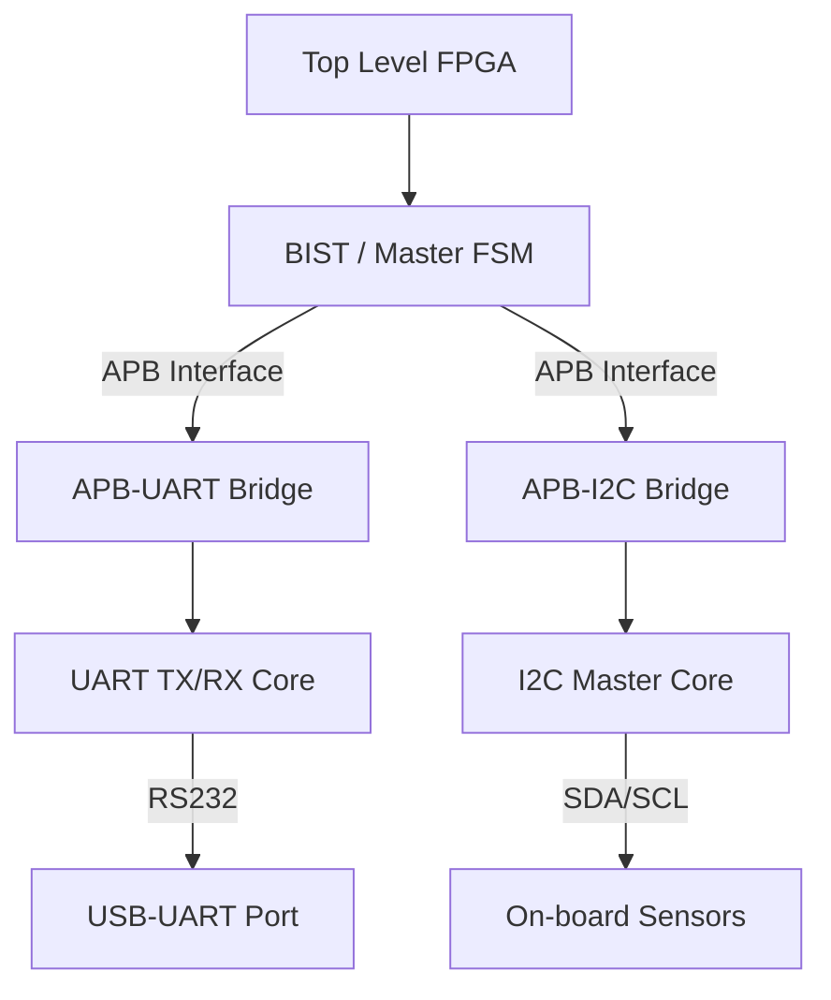

---

# 🚀 APB-SoC: Advanced Peripheral Bus System on Artix-7


-red?style=for-the-badge\&logo=xilinx)


A complete System-on-Chip (SoC) infrastructure implementing the **AMBA APB v3 protocol** to interface custom **UART** and **I2C** peripherals. Designed for the Digilent Nexys-4 FPGA and includes a hardware-based Built-In Self-Test (BIST) engine.

---

## 🧠 Project Overview

This repository provides a modular FPGA design demonstrating a realistic SoC-style peripheral subsystem.
All peripherals connect through a fully compliant **APB Slave Interface**, similar to ASIC/SoC architectures where a CPU (or Master FSM) accesses peripherals through memory-mapped registers.

### ✨ Key Features

**Bus Protocol**

* Full AMBA APB v3 support: `PSEL`, `PENABLE`, `PREADY`, `PSLVERR`.

**UART Core**

* Configurable baud rate (Default: 9600 @ 100 MHz).
* Interrupts on TX Done / RX Valid.
* Status flags for parity/frame errors.

**I2C Master Core**

* FSM-based master controller.
* Start/Stop/Read/Write operations.
* Clock synchronization and ACK-error handling.

**Hardware BIST**

* A top-level FSM that automatically tests the APB bus and all peripherals without a soft-core processor.

---

## 🏗️ Architecture

The design follows a hierarchical APB-interconnect-centric structure.



---

## 📝 Register Map

All communication uses 32-bit memory-mapped registers.

### 📡 UART Peripheral

| Offset | Name    | R/W | Description                    |
| ------ | ------- | --- | ------------------------------ |
| `0x00` | CONTROL | RW  | Configuration bits             |
| `0x04` | STATUS  | RO  | Busy, TX Done, RX Valid, Error |
| `0x08` | TX_DATA | RW  | Write byte to transmit         |
| `0x0C` | RX_DATA | RO  | Read received byte             |

### 🔌 I2C Peripheral

| Offset | Name    | R/W | Description                        |
| ------ | ------- | --- | ---------------------------------- |
| `0x00` | CONTROL | RW  | Start/Stop/Read/Write control bits |
| `0x04` | STATUS  | RO  | Busy, Done, ACK Error              |
| `0x08` | ADDR    | RW  | 7-bit slave address                |
| `0x0C` | TX_DATA | RW  | Data to write                      |
| `0x10` | RX_DATA | RO  | Data read from slave               |

---

## 🛠️ Verification & Testing

### Simulation

A complete testbench (`tb_top_level.v`) is included.
Features:

* Generates a 100 MHz clock.
* Drives button/switch inputs.
* Dumps `tb_top_level.vcd` for GTKWave.
* Self-checking for UART transmission integrity.

### Hardware Validation (Nexys-4)

The design maps cleanly to on-board peripherals:

* **LEDs [7:0]**: Heartbeat, UART IRQ, I2C IRQ, Test Pass.
* **Switches [1:0]**: Select test mode (`UART` / `I2C`).
* **Buttons**:

  * `BTN[0]`: Send next UART character
  * `BTN[2]`: System reset

---

## 📂 File Structure

* `apb_bus.v` — APB slaves, UART/I2C logic, and APB bridges.
* `top_level_fpga.v` — Top-level mapping and BIST FSM.
* `tb_top_level.v` — Simulation testbench.
* `top_level_fpga_netlist.v` — Yosys-generated gate-level netlist.

---

## 🚀 Getting Started

### 1. Clone the repository

```bash
git clone https://github.com/ApratimPhadke/APB-BUS-.git
```

### 2. Run Simulation (Icarus Verilog)

```bash
iverilog -o testbench tb_top_level.v top_level_fpga.v apb_bus.v
vvp testbench
gtkwave tb_top_level.vcd
```

### 3. Synthesize

Import the HDL sources into **Vivado**, or use **Yosys** with the provided gate-level netlist.

---

## 👤 Author

**Apratim Phadke**
GitHub | LinkedIn

Built with Verilog, coffee, and a focus on precise digital design.

---

